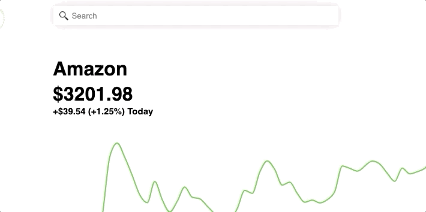

GrabbinGood is a fullstack application that mimics the qualities and features of Robinhood. The purpose of GrabbinGood is to display the same functionalities of Robinhood such as simulating trades or managing portfolios. This is done using real-time data through the use of an API. The money used in this application is fake and not real money.

[See the Live Site](https://grabbin-good.herokuapp.com/)

## Technologies Used
This fullstack application mainly uses Ruby on Rails for managing backend API while React manages the frontend. Redux is also used for application state management. 

### Frameworks/Libraries/Languages

* Ruby on Rails
* React
* Redux
* HTML
* CSS
* JavaScript

### APIs & External Libraries Used

* IEX Cloud
* Recharts

## Features

* One key feature that was implemented in this project is the search bar. Users will be able to search assets via ticker symbol or full name of the company. This was achieved by using an alogrithim to track user input and local state via react.



* Another key feature that was implemented is the portfolio value/user chart. The value of the portfolio was calculated by using rails association to determine the watchlists per user and then by fetching that data from the database. 


## Challenges / Solutions

* One challenge that I had come across was calculating the total portfolio value. Not only did I have to retrieve the financial data of the assets using an external API but I also had to factor in user account balance as well. I also had to keep in mind that the external API returned null values at times if the asset was not traded. My solution was to multiply the number of stocks the user owned to the 'high' value of the the asset. I then used concat in order to add the account balance. In the end I used a reducer function which added the values together to create the portfolio value at that specific time frame.


```
export const updateUserChart = (ownStocks, newAccBal) => dispatch => {
    let arr2 = [];
    ownStocks.forEach((stock) => {
        if (stock.num_stocks !== 0) {
        let stockSym = stock.stock_symbol;
        const promise = APIUtil.fetchInfoForStock(stockSym)
        arr2.push(promise)
        }
    })
    return Promise.all(arr2).then((arr) => {
        const reducer = (accumulator, currentValue) => accumulator + currentValue;
        let arrOfStockSym = ownStocks
        let i;
        let j;
        let newArrOfStockSym = arrOfStockSym.filter((watchlist) => {
            return watchlist.num_stocks !== 0
        })
        for (i = 0; i < arr.length; i++) {
            arr[i].forEach((obj, idx) => {
                if (obj.high === null) {
                    for (j = idx; j >= 0; j--) {
                        if (arr[i][j].high !== null) {
                            obj.high = arr[i][j].high
                            break;
                        }
                    }
                }
                else {
                obj.high = obj.high * newArrOfStockSym[i].num_stocks
                }
            })
        }
        let output = [];
        let flattened = arr.flat();

        flattened.forEach(function (item) {
            var existing = output.filter(function (v, i) {
                return v.label == item.label;
            });
            if (existing.length) {
                var existingIndex = output.indexOf(existing[0]);
                output[existingIndex].high = output[existingIndex].high.concat(item.high)
            } 
            else {
                if (typeof item.high == 'number')
                    item.high = [item.high];
                output.push(item);
            }
        });
         output.forEach((obj) => {
            obj.high = obj.high.concat(newAccBal)
        })
       
        output.forEach((obj) => {
            obj.high = obj.high.reduce(reducer)
        })
        return dispatch(receiveUserData(output))
    })
}

```

* Another Challenge that I encountered while coding was trying to implement the watchlist for the user. I need to retrieve the highest and lowest price for each asset to determine the percent change for the day. I implemented breaks in for loops to help time complexity. On top of this, I had to figure out which assets for users where 'owned' and which ones were simply 'watched'. I achieved this by giving 'watched' assets a value of 0 in my 'num_stocks' column and used jbuilder in order to help organize the data.

```
Promise.all(arrOwnStocks).then(arrOfObj => {
        let newArr = []
        let arrFirstPrice = []
            arrOfObj.forEach(arr => {
                let i;
                for (i = arr.length - 1; i > 0; i--) {
                    if (arr[i].high) {
                        newArr.push(arr[i].high)
                        break;
                    }
                }
                let j;
                for (j = 0; j < arr.length-1; j++) {
                    if (arr[j].high) {
                        arrFirstPrice.push(arr[j].high)
                        break;
                    }
                }
            })
            let k;
            let percentChangeArr = [];
            for (k = 0; k < newArr.length; k++) {
                let difference = newArr[k] - arrFirstPrice[k]
                let percentChange = (difference / arrFirstPrice[k]) * 100
                if (percentChange < 0) {
                    percentChangeArr.push(`${percentChange.toFixed(2)}%`)
                }
                else {
                    percentChangeArr.push(`+${percentChange.toFixed(2)}%`) 
                }
            }
            let listOfBought = []
            let listOfWatched = []
            let boughtStockPrice = []
            let boughtPercentChange = []
            let watchedStockPrice = []
            let watchedPercentChange = []
            let numOfShares = []
            this.props.watchlist.forEach((watchlist, idx) => {
                if (watchlist.num_stocks !== 0) {
                    boughtStockPrice.push(newArr[idx].toFixed(2))
                    boughtPercentChange.push(percentChangeArr[idx])
                    listOfBought.push(watchlist)
                    numOfShares.push(watchlist.num_stocks)
                }
                else {
                    watchedStockPrice.push(newArr[idx].toFixed(2))
                    watchedPercentChange.push(percentChangeArr[idx])
                    listOfWatched.push(watchlist)

                }
            })
```

## Upcoming Features!

* Allowing Users to input any amount of money.
* Allowing Portfolio data to show for week, month, and year.